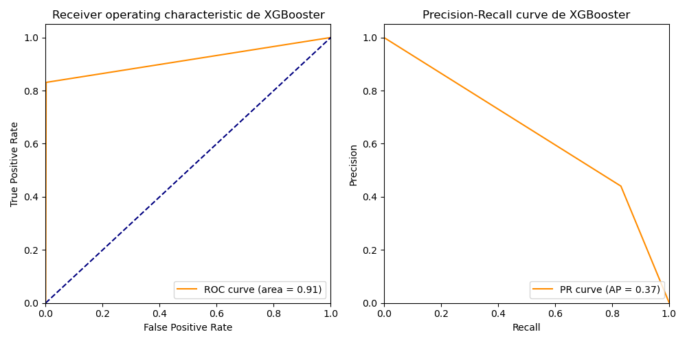
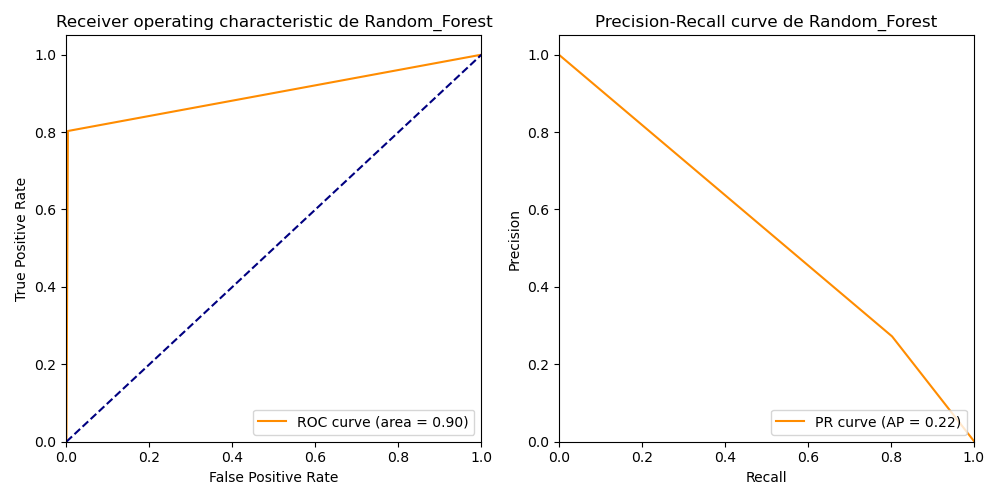

# Proyecto Final - Análisis de Fraude en Tarjetas de Crédito

Este proyecto es parte del Programa de Aprendizaje Basado en Proyectos en Inteligencia Artificial de IBM. Utiliza el dataset de [Kaggle: Credit Card Fraud Detection](https://www.kaggle.com/mlg-ulb/creditcardfraud) para identificar transacciones fraudulentas mediante técnicas de Machine Learning.

## Estructura del Repositorio
```plaintext
/
|-- data/                      # Carpeta para almacenar los datos descargados
|-- notebook/                 # Contiene el notebook principal del proyecto
|-- src/                   # Scripts Python reutilizables
|-- results/                   # Salidas, gráficos o modelos generados
|-- README.md                  # Descripción detallada del proyecto
|-- requirements.txt           # Dependencias del proyecto
|-- LICENSE                    # Licencia del repositorio

```

## Descripción del Problema
El fraude en transacciones con tarjetas de crédito representa una amenaza significativa tanto para las instituciones financieras como para los usuarios. Este proyecto busca identificar patrones en los datos que permitan detectar actividades sospechosas y prevenir fraudes.

El dataset utilizado contiene transacciones realizadas con tarjetas de crédito en septiembre de 2013 por titulares europeos. El conjunto de datos es altamente desbalanceado, con solo un 0.172% de transacciones clasificadas como fraudulentas.

## Tecnologías y Herramientas Utilizadas
- Python (versión 3.x)
- Bibliotecas: pandas, numpy, matplotlib, scikit-learn
- Jupyter Notebook
- API de Kaggle para la descarga de datos

## Cómo Ejecutar el Proyecto

### 1. Configurar el Entorno
Clona este repositorio y asegúrate de instalar las dependencias:
```bash
git clone https://github.com/tuusuario/tu-repositorio.git
cd tu-repositorio
pip install -r requirements.txt
```

### 2. Descargar el Dataset
Ejecuta el script `download.py` para descargar los datos desde Kaggle:
```bash
python scripts/download.py
```

Esto descargará y descomprimirá el dataset en la carpeta `data/`.

### 3. Explorar el Notebook
Abre el notebook principal en la carpeta `notebooks/` para explorar el análisis:
```bash
jupyter notebook notebooks/Proyecto_final.ipynb
```

### 4. Resultados
Ejecuta todas las celdas del notebook para replicar los resultados y visualizar los análisis realizados.

## Resultados Clave
- Se implementaron algoritmos de clasificación como Logistic Regression y Random Forest.
- Se aplicaron técnicas de manejo de datos desbalanceados como sobremuestreo (SMOTE).
- El modelo Random Forest alcanzó una alta precisión en la detección de transacciones fraudulentas, manteniendo una baja tasa de falsos positivos.

### Ejemplo de Visualización



## Dependencias
Lista de dependencias necesarias para el proyecto:
```
kaggle
pandas
numpy
matplotlib
scikit-learn
```

Instálalas usando el archivo `requirements.txt`:
```bash
pip install -r requirements.txt
```

## Licencia
Este proyecto está bajo la Licencia MIT. Consulta el archivo `LICENSE` para más información.

---

## Autor
[Jorge Israel Frómeta Moya] - Programa de Aprendizaje Basado en Proyectos en IA de IBM.


```python

```
